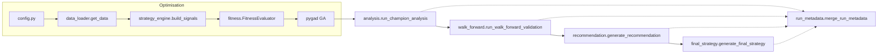

# AI Genetic Algorithm Trading Framework

The project is a modular research environment for evolving algorithmic trading
strategies with a genetic algorithm (GA). It orchestrates signal generation,
vectorbt backtests, multi-asset scoring, walk-forward validation, a narrative
recommendation report, and a final portfolio synthesis pass. All stages record
metadata so results can be reproduced or audited later.



## Who should read this repository?

- **Quant researchers & strategists** – configure indicator rules in
  `strategy_rules.py`, tune GA parameters in `config.py`, and interpret the
  recommendation/final-strategy artifacts produced after validation.
- **Platform & operations engineers** – run batch jobs, manage dependencies,
  watch caching, and collect artifacts for downstream review. See
  `docs/operations.md` for the detailed runbook.
- **Automation agents & contributors** – follow `AGENTS.md` for repository
  conventions, CI expectations, and change-management rules.

## Quick start

1. **Python environment** – Use Python 3.12 or 3.13. Optional but recommended:
   `python -m venv .venv && source .venv/bin/activate`.
2. **Install dependencies** – `python -m pip install -r requirements.txt -r
   requirements-dev.txt`.
3. **Environment variables** – Copy `.env.example` to `.env` and fill in values
   such as `BINANCE_API_KEY`, `BINANCE_API_SECRET`, `BINANCE_TLD`, `GA_SEED`,
   and feature toggles like `GA_QUICK_TEST` (reduced GA loop) or `USE_VBT_STUB`
   (uses the vectorbt stub in tests).
4. **Verify vectorbt** – The framework requires the real package, not
   `vbt_stub.py`. You can verify the installation with:

   ```bash
   python -c "from deps import ensure_real_vectorbt; ensure_real_vectorbt()"
   ```

5. **Run an optimisation** – `python main.py`. The script performs an indicator
   preflight, runs PyGAD against the configured gene space, saves fitness plots,
   and triggers champion analysis. When walk-forward validation is enabled it
   will also call the recommendation and final-strategy stages.
6. **Explore additional workflows**:
   - `python walk_forward.py` – rolling train/test windows with metadata.
   - `python tuner.py` – sweep GA hyperparameters (`sol_per_pop`,
     `num_parents_mating`, `mutation_num_genes`).
   - `python preflight.py` – standalone indicator contract checks.

## Documentation map

- [`docs/getting_started.md`](docs/getting_started.md) – installation and
  day-one usage for researchers.
- [`docs/architecture.md`](docs/architecture.md) – module relationships and the
  data/metadata contracts between them.
- [`docs/strategy_authoring.md`](docs/strategy_authoring.md) – how to design new
  entry rules, expose GA genes, and keep indicator contracts healthy.
- [`docs/operations.md`](docs/operations.md) – runbook for orchestrating full
  experiments and curating artifacts.
- [`AGENTS.md`](AGENTS.md) – automation and contribution guide (tests, style,
  CI expectations).

## Core modules at a glance

| Module | Responsibility |
| --- | --- |
| `config.py` | Central configuration (data source, GA knobs, multi-asset policy, recommendation/final-strategy settings). Calls `validate_final_strategy_config` before synthesis. |
| `data_loader.py` | Fetches OHLCV data from Binance US or yfinance with deterministic cache naming via `build_cache_stem`. |
| `indicator_library.py` & `indicator_contracts.py` | Implement indicators using `pandas_ta` and describe expected output columns/bands. |
| `strategy_engine.py` | Builds entry signals, handles majority voting, NaN policies, and indicator column selection. |
| `fitness.py` | Wraps vectorbt backtests for single- and multi-asset evaluation. Applies composite metrics and winsorisation. |
| `analysis.py` | Runs champion validation, plots GA progress, and records hashes plus library versions through `run_metadata.merge_run_metadata`. |
| `walk_forward.py` | Generates rolling training/test windows, evaluates champions, and writes schema v1.0 summary/per-asset artifacts for downstream stages. |
| `recommendation.py` | Produces `strategy_recommendation.md` and an auditable recommendation payload (`confidence`, asset stance, parameter stability). |
| `final_strategy.py` | Consumes walk-forward + recommendation outputs, enforces gating rules, and emits `final_strategy.md` with weighted parameters and portfolio allocation. |

## Data, caching, and reproducibility

- `data_loader.py` caches Parquet files in `data_cache/`. Cache stems include
  ticker, source, date range, and timeframe so repeated runs are deterministic.
- `analysis.run_champion_analysis`, `walk_forward`, `recommendation`, and
  `final_strategy` each call `merge_run_metadata` to append hashes, timing, and
  artifact pointers inside `run_metadata.json`.
- Set `config.PREFLIGHT_ALL_INDICATORS = True` to compute every indicator before
  optimisation, surfacing missing column/band issues early.
- Trade floor policies (`trade_floor.py`) and composite metrics rely on
  deterministic seeds (`config.SEED` or `GA_SEED` env) to keep GA runs
  repeatable across environments.

## Outputs

Running `python main.py` (with walk-forward enabled) produces the following key
artifacts inside the run directory (default: project root):

- `ga_fitness_evolution.png` – snapshot of per-generation best fitness.
- `analysis/` plots and CSV summaries from champion analysis.
- `walk_forward/walk_forward_summary.json` &
  `walk_forward/walk_forward_per_asset.csv` – schema v1.0 artifacts consumed by
  the recommendation and final strategy stages.
- `strategy_recommendation.md` + `run_metadata.json["recommendation"]` –
  confidence score, asset classes, and parameter stability notes generated by
  `recommendation.generate_recommendation`.
- `final_strategy.md` + `run_metadata.json["final_strategy"]` – parameter and
  asset-weight synthesis from `final_strategy.generate_final_strategy`.

## Quality gates

The project ships with an automated test suite and pre-commit hooks. Before
opening a pull request run:

```bash
pytest -q              # or pytest -q -n auto for a parallel run
pre-commit run -a      # formatting, lint, and safety checks
```

Continuous integration mirrors these commands on Python 3.12 and 3.13 and also
executes CodeQL/Bandit security scans. Keep the tree free of secrets—API keys
must be provided via environment variables.
