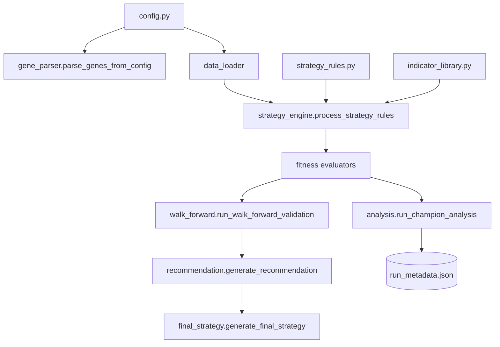

# AI Genetic Algorithm Trading Framework

**Audience:** quantitative researchers and developers who need a reproducible pipeline for discovering systematic trading strategies.

This repository packages a multi-stage research workflow: it loads price data, evaluates configurable trading rules, and evolves their parameters with a genetic algorithm (GA). Runs automatically persist metadata, plots, and recommendations so results can be audited or reproduced later. Out of the box the framework supports both single-asset and multi-asset studies with dispersion penalties and trade-floor policies.

## Documentation map

- [Getting Started](docs/getting_started.md) – environment setup and first run checklist for practitioners.
- [Configuration Reference](docs/configuration.md) – detailed guide to `config.py` toggles, data windows, and fitness knobs.
- [Strategy Authoring Guide](docs/strategy_authoring.md) – how to extend `STRATEGY_RULES` with new entry/exit logic and GA genes.
- [Architecture Overview](docs/architecture.md) – module relationships for contributors.
- [Operations Runbook](docs/operations_runbook.md) – production playbook for scheduled runs and troubleshooting.
- [Agents Guide](AGENTS.md) – automation guardrails for coding agents.

## Key capabilities

- **Deterministic parameter search:** `pygad` drives the GA with seedable randomness, optional quick-test overrides, and an express tuner that sweeps population settings before long runs.
- **Multi-asset fitness evaluation:** aggregate per-asset results with configurable weights, dispersion penalties (`lambda_dispersion`), trade floors, and zero-trade policies. Champion strategies feed walk-forward validation, a recommendation engine, and final portfolio synthesis.
- **Cache-aware data loading:** fetches Binance.US or `yfinance` OHLCV, normalises tickers (e.g. `BTC-USD → BTCUSDT`), and manages Parquet caches under `data_cache/` while warning about missing volume data for volume-sensitive indicators.
- **Extensible indicator toolbox:** indicators auto-register from `indicator_library.py`; the strategy engine caches outputs, resolves default columns/bands, and honours `strict_column` and `nan_policy` settings.
- **Preflight & metadata:** every run validates indicator contracts before optimisation, records library versions, cache hashes, and artifacts in `run_metadata.json`, and stores plots plus reports under `Reporting/<timestamp>_<timeframe>`.

## System requirements

- Python 3.12 or 3.13 (64-bit recommended).
- Access to the real [`vectorbt`](https://github.com/polakowo/vectorbt) package; `deps.ensure_real_vectorbt` aborts if a stub or incomplete install is detected.
- Optional Binance.US API credentials for live data. Without them the loader falls back to `yfinance` for compatible tickers.
- Unix-like shell (macOS/Linux/WSL) is recommended for the provided commands.

## Setup

1. Clone the repository and create an isolated environment:
   ```bash
   git clone https://github.com/<your-org>/Gen_Algo.git
   cd Gen_Algo
   python -m venv .venv
   source .venv/bin/activate  # On Windows use .venv\Scripts\activate
   ```
2. Install runtime dependencies:
   ```bash
   python -m pip install -r requirements.txt
   ```
3. (Optional) Install developer tooling for linting and tests:
   ```bash
   python -m pip install -r requirements-dev.txt
   pre-commit install
   ```
4. Copy the environment template and populate secrets as needed:
   ```bash
   cp .env.example .env
   ```
   Export or fill in values for `GA_SEED`, `BINANCE_TLD`, `BINANCE_API_KEY`, `BINANCE_API_SECRET`, `GA_QUICK_TEST`, and `USE_VBT_STUB` (set to `0` when running full vectorbt backtests).
5. Ensure the real `vectorbt` package is visible to Python:
   ```bash
   python - <<'PY'
   from deps import ensure_real_vectorbt
   ensure_real_vectorbt()
   print('vectorbt check passed')
   PY
   ```

## Run an optimisation

The orchestrator lives in `main.py`. By default the configuration enables multi-asset optimisation, automatic walk-forward validation, recommendation generation, and final strategy synthesis.

```bash
python main.py
```

During the run you will see a generation-by-generation progress bar followed by the best fitness score and parameter values found. Artifacts are written to `Reporting/<run_id>` (e.g. `Reporting/20250101T120000Z_4h/`) and include:

- `ga_fitness_evolution.png` – the optimisation learning curve.
- `run_metadata.json` – reproducibility payload with cache hashes, library versions, and downstream analysis metadata.
- Walk-forward CSV/JSON outputs, `strategy_recommendation.md`, and `final_strategy.json` when enabled.

Use the `--no-fss` flag to skip the final strategy synthesiser while still running optimisation, analysis, and walk-forward validation.

## Additional workflows

- **Quick experiments:** set `GA_QUICK_TEST=1` (or `true`) to shrink the population and generation count for smoke tests.
- **Force indicator coverage checks:** toggle `config.PREFLIGHT_ALL_INDICATORS = True` to compute every registered indicator once and fail early if a contract is violated.
- **Re-run walk-forward validation:** invoke from a Python session if you want to reuse cached champions without rerunning the GA.
  ```python
  from pathlib import Path
  import data_loader, walk_forward
  import config

  config.initialize_config(force=True)
  wf_data = data_loader.get_group_data(
      asset_group=config.ASSET_GROUP,
      start_date='2022-01-01',
      end_date='2024-12-31',
      interval=config.TIMEFRAME,
      coverage_threshold=config.COVERAGE_THRESHOLD,
      verbose=False,
  )
  walk_forward.run_walk_forward_validation(Path('Reporting/latest'), initial_champions=[], data=wf_data)
  ```
- **Regenerate reports:** both `recommendation.generate_recommendation({'run_dir': run_path})` and `final_strategy.generate_final_strategy({'run_dir': run_path})` can be called to refresh artifacts after adjusting configuration thresholds.

## Data caching & reproducibility

`data_loader.get_data` and `get_group_data` cache OHLCV data in `data_cache/` using normalised stems (ticker, source, start/end dates, timeframe). Every optimisation run logs the cache filenames and SHA-256 hashes in `run_metadata.json`. When `config.MULTI_ASSET['enabled']` is true the loader aligns all assets to the longest history and drops symbols that fall below `config.COVERAGE_THRESHOLD`.

Metadata emitted by `analysis`, `walk_forward`, `recommendation`, and `final_strategy` merges into the same `run_metadata.json`, making it simple to diff runs or feed downstream automation.

## Testing & linting

Continuous integration expects linting and tests to pass. Locally you can reproduce the pipeline with:

```bash
pre-commit run -a
pytest -q
# or run the full suite with coverage thresholds
make test
```

## High-level architecture



## License & disclaimer

This project is released under the [MIT License](LICENSE).

> **Disclaimer:** The framework is for research and educational purposes only. Trading carries significant risk; thoroughly evaluate any strategy before risking capital. Past performance is not indicative of future results.
