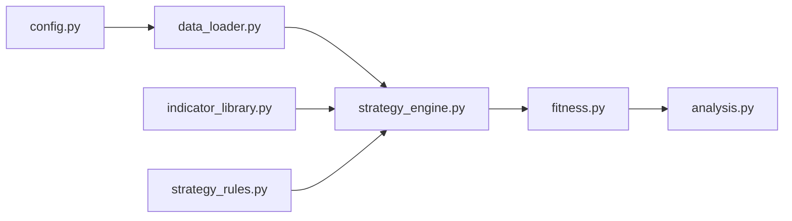

# Architecture

**Audience:** Developers and maintainers extending the framework.

The project is organised as a set of small modules with clear inputs and outputs. Core relationships are shown below.



### Fitness Evaluation Example

The `FitnessEvaluator` wraps the backtesting engine and composite score:

```python
portfolio = vbt.Portfolio.from_signals(
    close=self.ohlc_data["Close"],
    entries=entries,
    exits=time_based_exit,
    sl_stop=sl_stop,
    tp_stop=tp_stop,
    sl_trail=sl_trail,
    fees=config.FEES,
    freq=config.to_pandas_freq(config.TIMEFRAME),
)
stats = portfolio.stats()
```

Each module is designed for deterministic behaviour and should be accompanied by tests when modified.
