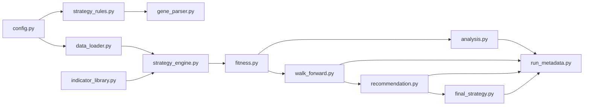

# Architecture

**Audience:** developers and maintainers extending the framework or integrating it into a larger research stack.

The codebase is intentionally modular: configuration defines behaviour, dedicated loaders fetch data, the strategy engine builds entry/exit signals, and fitness evaluators own scoring. Downstream components (analysis, walk-forward, recommendation, final strategy) build on a shared metadata contract.

## Component map



### Module responsibilities

| Module | Responsibility | Key details |
| --- | --- | --- |
| `config.py` | Centralised experiment settings | Derives training/validation windows, clamps GA gene ranges, handles environment overrides, and validates `FINAL_STRATEGY` payloads. `initialize_config()` must be called before accessing derived globals. |
| `data_loader.py` | Data acquisition and caching | Normalises tickers (`BTC-USD → BTCUSDT` for Binance), saves Parquet caches, emits warnings when volume columns are missing, and exposes `get_group_data` for multi-asset alignment with coverage checks. |
| `indicator_library.py` | Indicator implementations | Uses `pandas-ta`, auto-registers functions via the `@indicator` decorator, and declares parameter constraints. Ensures compatibility with both numpy and pandas versions. |
| `strategy_engine.py` | Rule interpreter & indicator cache | Resolves indicator aliases, selects default columns/bands for multi-output indicators, enforces `strict_column` logic, combines signals under `AND`/`OR`/`VOTE`, and keeps a weak-ref cache of indicator outputs with guardrails defined in `config.CACHE_GUARDRAILS`. |
| `fitness.py` | Fitness evaluation layer | Provides single-asset and multi-asset evaluators. Injects GA genes, executes vectorbt backtests, applies composite metrics with winsorisation, trade-floor scaling, zero-trade policies, and optional stability regularisers. |
| `analysis.py` | Champion analysis & metadata writer | Re-runs the champion on validation data, saves plots, hashes cache files, records library versions, and merges metadata via `run_metadata.merge_run_metadata`. |
| `walk_forward.py` | Rolling validation | Generates rolling training/testing windows, keeps a champion pool with cloning rules, rescales trade floors per window, and writes schema-validated CSV/JSON artifacts. |
| `recommendation.py` | Strategy recommendation engine | Classifies assets (Stars/Stalwarts/Gambles/Drags), computes confidence scores from walk-forward folds, and records parameter stability diagnostics. |
| `final_strategy.py` | Portfolio synthesis | Filters assets by recommendation confidence, applies weighting schemes (`risk_adjusted`, `equal`, `proportional`, or `override`), evaluates parameter robustness (RCV, multimodality), and emits final trade-ready payloads. |

### Fitness evaluation flow

The multi-asset evaluator aggregates per-asset backtests while enforcing dispersion and trade-floor policies:

```python
from fitness import MultiAssetFitnessEvaluator
from strategy_rules import STRATEGY_RULES
from params_resolver import resolve_effective_rules

evaluator = MultiAssetFitnessEvaluator(
    ohlc_data=training_data,            # dict[ticker, DataFrame]
    base_rules=STRATEGY_RULES,
    gene_map=gene_map,                  # produced by gene_parser
    settings=config.MULTI_ASSET,
)
score = evaluator(ga_instance, candidate_solution, solution_idx)
```

Key behaviours:

- `inject_genes_into_rules` applies GA chromosomes to a deep copy of `STRATEGY_RULES` before indicators are computed.
- Metrics are normalised through `metrics_contract.evaluate_metrics`, which handles alias drift and missing fields by computing fallbacks.
- Dispersion penalties subtract `lambda_dispersion * std(per-asset scores)` while respecting `coverage_penalty` and `zero_trade_policy`.
- Trade floors are scaled to each evaluation window via `trade_floor.scale_floor`, ensuring minimum trades scale with elapsed years.

### Indicator selection & caching

`strategy_engine` normalises indicator names, merges default bands/columns, and caches outputs keyed by `(indicator, params, data_id, columns)`. Cache guardrails (`MAX_CACHE_KEYS`, `MAX_CACHE_ROWS`) prevent excessive memory growth. Preflight routines in `preflight.py` call `indicator_library` and `indicator_contracts` to ensure each active rule has the expected columns before optimisation begins.

### Metadata contract

All major stages call `run_metadata.merge_run_metadata(path, payload)` so downstream steps append to the same JSON artifact instead of overwriting it. Typical metadata keys include:

- `artifact_version`, `start_time`, `end_time`, `wall_time`
- `cache_files` with SHA-256 hashes for every dataset pulled from `data_cache/`
- `library_versions` (`numpy`, `pandas`, `vectorbt`, `pygad`)
- `recommendation`, `final_strategy`, and per-fold diagnostics when applicable

Adhering to this contract keeps runs reproducible and enables external tooling to consume the outputs without parsing bespoke formats.

### Contributing tips

- Always call `config.initialize_config(force=True)` in tests when overriding globals.
- Prefer extending `indicator_library.py` instead of inlining TA logic; the auto-registration keeps the strategy engine declarative.
- When adding new metrics, update `metrics_contract.METRIC_ALIASES` and provide fallbacks so missing statistics do not crash the GA.
- Any change that alters output structure should update the documentation and tests; CI enforces linting, coverage, and pre-commit hooks.
