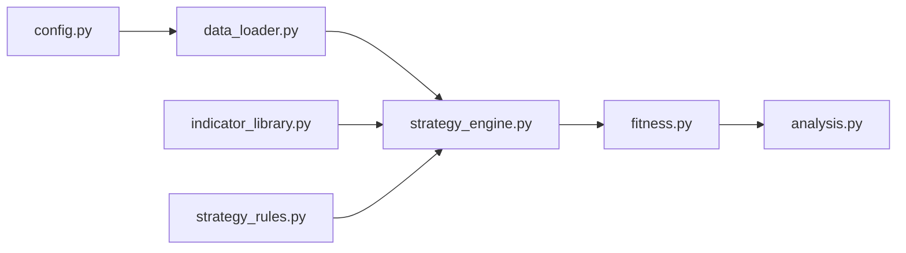

# Architecture

**Audience:** Developers and maintainers extending the framework.

The project is organised as a set of small modules with clear inputs and outputs. Core relationships are shown below.



### Fitness Evaluation Example

The `FitnessEvaluator` wraps the backtesting engine and composite score:

```python
portfolio = vbt.Portfolio.from_signals(
    close=self.ohlc_data["Close"],
    entries=entries,
    exits=time_based_exit,
    sl_stop=sl_stop,
    tp_stop=tp_stop,
    sl_trail=sl_trail,
    fees=config.FEES,
    freq=config.to_pandas_freq(config.TIMEFRAME),
)
metrics, sources, missing = metrics_contract.evaluate_metrics(portfolio)
```

Each module is designed for deterministic behaviour and should be accompanied by tests when modified.

### Metric Contract

`metrics_contract.py` centralises statistic aliases, unit normalisation, and fallback logic. The canonical metrics and fallbacks are:

| Canonical key   | Accepted aliases (subset)                          | Unit            | Fallback formula                                      |
|-----------------|-----------------------------------------------------|-----------------|------------------------------------------------------|
| `sortino`       | `Sortino Ratio`, `sortino_ratio`, `Sortino`         | ratio           | Mean excess return ÷ downside deviation × √252       |
| `profit_factor` | `Profit Factor`, `PF`, `profit_factor`              | ratio           | Σ positive returns ÷ Σ absolute negative returns     |
| `max_drawdown`  | `Max Drawdown [%]`, `Max Drawdown`, `max_drawdown`  | percent (0–100) | Max peak-to-trough drop of cumulative returns        |
| `total_return`  | `Total Return [%]`, `Return [%]`, `total_return`    | percent (0–100) | `(1 + returns).prod() - 1`                           |

`resolve_metrics` tries the fast-path labels, falls back to the cached alias map, and `_to_pct` harmonises fractional/percentage units. `compute_fallbacks` populates missing metrics from raw returns. Prefer `evaluate_metrics` for a single call returning the metrics, their sources (alias vs. `"computed"`), and any remaining missing keys.

Before large runs, `assert_metric_aliases` verifies that at least one alias per metric exists. Its behaviour is controlled via `config.METRICS_PREFLIGHT` (`mode`: `"warn"|"fail"`, `missing_threshold`: tolerated missing aliases). During evaluation the resolved mapping is logged once (e.g. `sortino→sortino_ratio`) and the first asset records `metric_sources` in `MultiAssetFitnessEvaluator.last_details`. When trades execute but metrics remain unavailable the evaluator surfaces `evaluation_reason="metrics_missing"` for that asset.

Continuous integration runs the test suite across a pinned environment (`vectorbt==0.28.1`, `quantstats>=0.0.62`) and floating environments with and without QuantStats to catch alias drift early.
