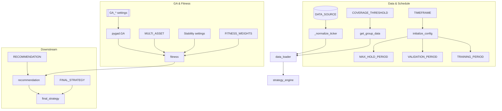

# Configuration Reference

**Audience:** operators and researchers tuning experiments through `config.py` without digging through the full codebase.

The configuration module is the control surface for the entire framework. It is evaluated at import time, but many values are derived lazily inside `initialize_config()`. Call `config.initialize_config()` before reading `TRAINING_PERIOD`, `VALIDATION_PERIOD`, `MAX_HOLD_PERIOD`, or other computed globals.

## Loading order and derived values

```python
import config

config.initialize_config()          # populate derived globals
print(config.TRAINING_PERIOD)
print(config.VALIDATION_PERIOD)
print(config.MAX_HOLD_PERIOD)
```

`initialize_config()` performs the following:

1. Detects the current timeframe and translates it into validation bar counts, RSI bounds, and max hold periods (expressed in bars for intraday timeframes).
2. Computes rolling training/validation windows based on `VALIDATION_MONTHS` and the current date.
3. Normalises Binance tickers to USDT and stores the resolved value in `config.TICKER`.
4. Seeds walk-forward defaults (`WALK_FORWARD_SETTINGS`) so downstream modules can override selectively.
5. Validates `STRATEGY_RULES` combination logic and clamps vote-threshold genes to the number of active conditions.

## Data sources and asset universe

Key switches:

- `DATA_SOURCE = "binance" | "yfinance"`
- `CRYPTO_UNIVERSE` – friendly name → ticker mapping used across the project.
- `ASSET_GROUP` – list of `(name, ticker)` pairs evaluated when `MULTI_ASSET['enabled']` is true.
- `COVERAGE_THRESHOLD` – minimum fraction of aligned bars required to keep an asset during multi-asset data alignment.

Example override:

```python
SELECTED_ASSET_NAME = "Ethereum"
TIMEFRAME = "1h"
DATA_SOURCE = "yfinance"
ASSET_GROUP = [("Bitcoin", "BTC-USD"), ("Ethereum", "ETH-USD"), ("Solana", "SOL-USD")]
MULTI_ASSET["enabled"] = True
```

## Genetic algorithm knobs

- `GA_POPULATION_SIZE`, `GA_NUM_GENERATIONS`, `GA_PARENTS_MATING`, `GA_MUTATION_NUM_GENES`
- `AUTO_TUNE_ENABLED` toggles the express tuner. When enabled the tuner sweeps `HYPERPARAMETER_SEARCH_SPACE` and returns the best combination before the main GA run.
- Environment shortcut: set `GA_QUICK_TEST=1` to shrink the population and generation count for smoke testing.

Composite fitness weights live in `FITNESS_WEIGHTS`; adjust them when prioritising different metrics (`sortino_ratio`, `profit_factor`, `max_drawdown`, `min_trades`).

## Multi-asset evaluation settings

`MULTI_ASSET` controls dispersion penalties, trade floors, and error handling. Notable keys:

- `lambda_dispersion` and `lambda_grid` – configure penalty strength or sweep candidates with the tuner.
- `per_asset_min_trades`, `min_total_trades`, `min_total_trades_per_year` – converted into concrete floors via `trade_floor.scale_floor` for each evaluation window.
- `zero_trade_policy` – `"ignore"` or `"penalize"`; optional `zero_trade_penalty` is applied when ignoring assets.
- `coverage_penalty` – penalty applied when assets drop below `COVERAGE_THRESHOLD`.
- `parallel` – enable threaded or process-based evaluation (disabled by default to favour determinism).

## Stability regularisation

Enable the stability penalty to discourage volatile parameters across folds:

```python
ENABLE_STABILITY_REG = True
STABILITY_ALPHA = 0.1
STABILITY_GENES = ["rsi_period", "ema_period"]
```

The evaluator will subtract `STABILITY_ALPHA * coefficient_of_variation` for each gene listed, nudging the GA towards tighter parameter distributions.

## Recommendation & final strategy

Two downstream modules rely on configuration sections:

- `RECOMMENDATION` – defines weighting of median fitness, fold consistency, tail behaviour, and downside deviation. Adjust thresholds for asset classes (Stars/Stalwarts/Gambles/Drags) and sensitivity to parameter variability (`PARAM_COV_*`).
- `FINAL_STRATEGY` – governs which asset classes are eligible (`INCLUDE_CLASSES`), minimum consistency, weighting scheme (`risk_adjusted`, `equal`, `proportional`, or `override`), caps/floors, and sensitivity thresholds for parameters and weights. `validate_final_strategy_config()` enforces logical constraints (e.g., override weights must sum to 1.0).

Example configuration snippet:

```python
FINAL_STRATEGY = {
    "INCLUDE_CLASSES": ["Stars", "Stalwarts", "Gambles"],
    "MIN_ASSET_CONSISTENCY": 55.0,
    "WEIGHTING_SCHEME": "risk_adjusted",
    "MAX_WEIGHT_CAP": 0.40,
    "MIN_WEIGHT_FLOOR": 0.02,
    "PARAM_RCV_UNSTABLE": 0.6,
    "PARAM_SENSITIVITY_THRESHOLD": 0.2,
}
```

## Environment toggles

Several behaviours are controlled via environment variables to avoid editing code for quick tests:

| Variable | Effect |
| --- | --- |
| `GA_SEED` | Overrides `config.SEED` for deterministic runs. |
| `GA_QUICK_TEST` | When truthy, reduces GA generations/population. |
| `USE_VBT_STUB` | Allows tests to swap in a lightweight vectorbt stub. Set to `0` for full backtests. |
| `PREFLIGHT_ALL_INDICATORS` | When set (or toggled in config), evaluates every registered indicator once before optimisation. |
| `ENV` | When `prod`/`production`, suppresses verbose recommendation logs. |
| `FSS_STRICT` | Enforces strict weighting overrides in `final_strategy`. |

## Visual reference



Keep configuration changes under version control and document rationale in commits; most behavioural adjustments flow directly from `config.py` into the optimisation pipeline.
