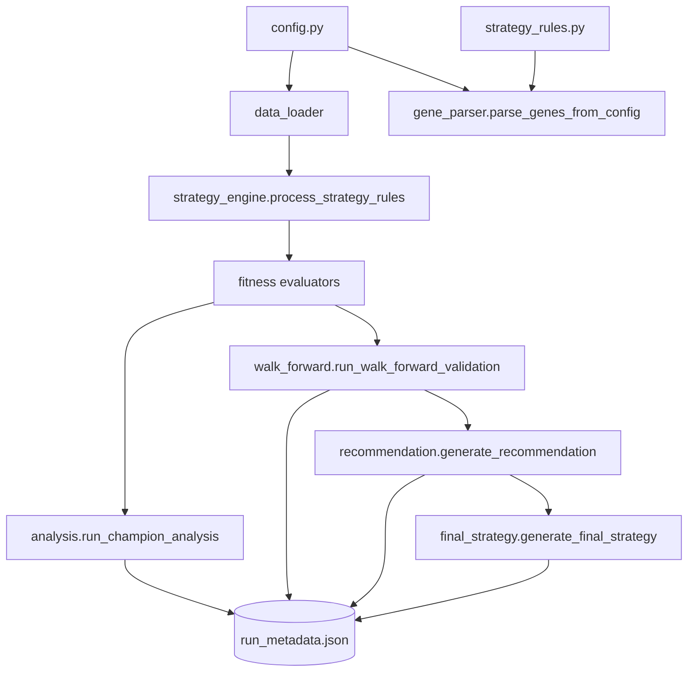

# Getting Started

**Audience:** traders and quantitative researchers running the framework for the first time.

This quick-start walks through environment setup, configuration touch-points, and what to expect from a full optimisation run.

## 1. Prerequisites

- Python 3.12 or 3.13 with `pip` available on your PATH.
- Unix-like shell (Linux, macOS, or WSL). Windows PowerShell works with minor command adjustments.
- Optional Binance.US API credentials for live market data. Without them the loader transparently falls back to Yahoo Finance for compatible tickers.

## 2. Install and bootstrap the project

```bash
python -V   # confirm Python 3.12/3.13
python -m venv .venv
source .venv/bin/activate  # .venv\Scripts\activate on Windows
python -m pip install -r requirements.txt
python -m pip install -r requirements-dev.txt  # optional lint/tests
pre-commit install                              # optional
cp .env.example .env
```

Populate `.env` (or export variables) with the Binance keys, desired `GA_SEED`, and optional toggles like `GA_QUICK_TEST=1` for smoke runs or `USE_VBT_STUB=0` to force the real vectorbt engine. The first invocation of `main.py` also validates that the genuine `vectorbt` package is installed.

## 3. Configure your experiment

Key switches live in `config.py`:

```python
SELECTED_ASSET_NAME = "Bitcoin"
TIMEFRAME = "4h"
DATA_SOURCE = "binance"  # or "yfinance"
MULTI_ASSET["enabled"] = True
ENABLE_WALK_FORWARD_VALIDATION = True
```

Entry and exit rules live in `strategy_rules.py`. Each rule can expose GA genes by declaring `{"gene": "name", "low": ..., "high": ..., "step": ...}` and can be toggled with `"is_active": True/False`. When the configuration is loaded, helper functions normalise RSI bounds, clamp vote thresholds, and derive train/validation windows from the current date.

## 4. Run an optimisation

Launch the orchestrator:

```bash
python main.py
```

What happens under the hood:



You will see a generation-by-generation console update (`Generation X/Y | Best Fitness ... | Est. Time Left ...`). After convergence the script prints the champion parameters, saves the GA learning curve plot, and (when enabled) executes walk-forward validation, recommendation scoring, and final portfolio synthesis.

## 5. Inspect artifacts

Outputs are stored under `Reporting/<timestamp>_<timeframe>/` and typically include:

- `ga_fitness_evolution.png` – optimisation learning curve.
- `run_metadata.json` – reproducibility payload with cache hashes and library versions.
- `walk_forward/` CSV and JSON summaries when validation is enabled.
- `strategy_recommendation.md` and `final_strategy.json` when the downstream stages complete successfully.

The `Reporting/latest` symlink (or `Reporting/LATEST_RUN.txt` on platforms without symlink support) always points at the most recent run.

## 6. Next steps

- Set `GA_QUICK_TEST=1` for rapid iteration while editing rules or indicators.
- Enable `config.PREFLIGHT_ALL_INDICATORS = True` to compute every registered indicator once, catching missing columns or contract violations before the GA starts.
- Consult the [Configuration Reference](configuration.md) to customise trade floors, dispersion penalties, or recommendation thresholds.
- Dive into the [Strategy Authoring Guide](strategy_authoring.md) when adding new indicators or rule types.
