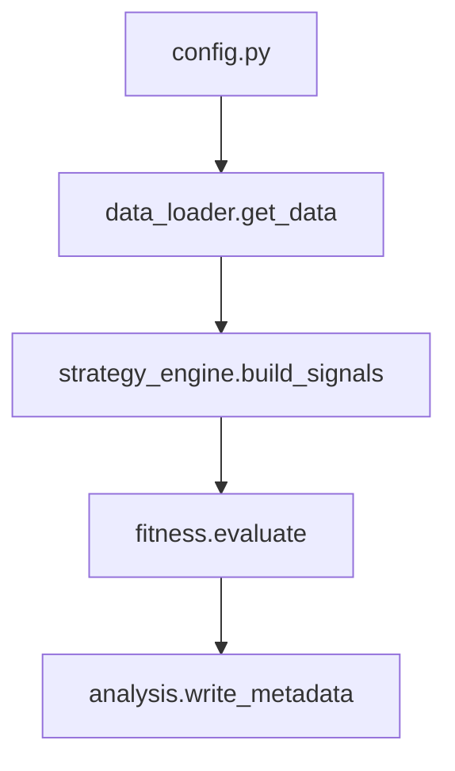

# Getting Started

**Audience:** Traders and quantitative researchers who want to run the Genetic Algorithm (GA) trading framework.

This guide walks through environment setup, basic usage, and how the main modules interact.

## Installation

```bash
python -V   # Python 3.12 or 3.13
python -m pip install -r requirements.txt -r requirements-dev.txt
```

## Running an Optimization

```bash
python main.py
```

The script reads configuration from `config.py`, pulls data, evolves strategies, and prints a summary of the best candidate. Walk‑forward analysis and GA hyper‑parameter sweeps are available via `walk_forward.py` and `tuner.py`.

## Customising Rules

Strategy rules live in `strategy_rules.py`. Each rule can be toggled with `is_active` and may expose parameters as GA genes:

```python
{
    "is_active": True,
    "rule_name": "RSI_Momentum_Filter",
    "indicator": "rsi",
    "params": {
        "period": {"gene": "rsi_period", "low": 5, "high": 35, "step": 1}
    },
    "condition": {
        "type": "indicator_is_above_value",
        "value": {
            "gene": "rsi_threshold",
            "low": 45,
            "high": 70,
            "step": 1,
        },
    },
}
```

## Data and Signal Flow



The flow begins with configuration, fetches cached or remote data, builds entry/exit signals, evaluates fitness, and records metadata and plots.
