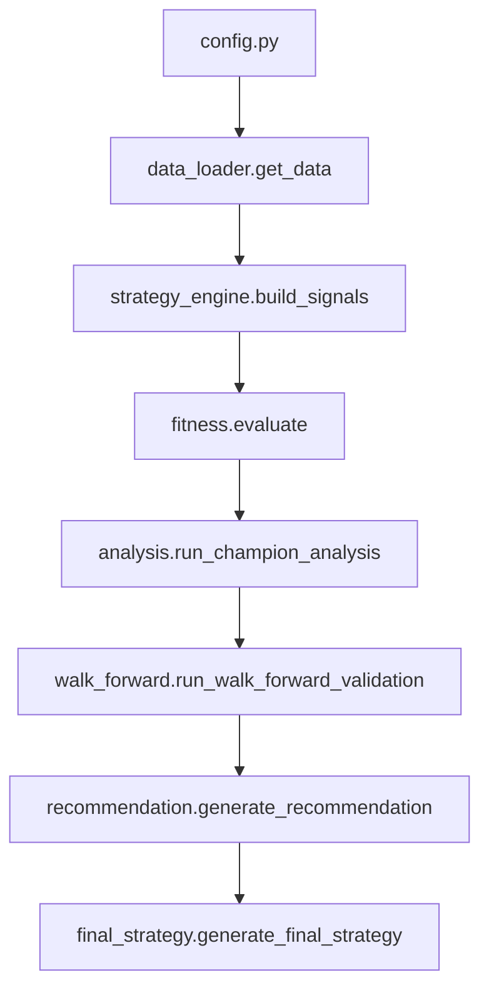

# Getting Started

**Audience:** Traders and quantitative researchers who want to run the Genetic
Algorithm (GA) trading framework.

This guide walks through environment setup, configuration, and the core
workflow from optimisation to final deliverables.

## Requirements

- Python 3.12 or 3.13 (virtual environments recommended).
- A working installation of the real [`vectorbt`](https://vectorbt.dev) package.
- Optional API credentials for Binance US when running live downloads.

Verify the correct `vectorbt` installation at any time with:

```bash
python -c "from deps import ensure_real_vectorbt; ensure_real_vectorbt()"
```

## Installation

```bash
python -m venv .venv            # optional but recommended
source .venv/bin/activate
python -m pip install -r requirements.txt -r requirements-dev.txt
```

## Configure environment variables

1. Copy `.env.example` to `.env` and populate the entries:
   - `BINANCE_API_KEY`, `BINANCE_API_SECRET`, `BINANCE_TLD` – live data access.
   - `GA_SEED` – overrides `config.SEED` for deterministic experiments.
   - `GA_QUICK_TEST=1` – optional flag that halves GA sizes for smoke tests.
   - `USE_VBT_STUB=1` – injects the lightweight vectorbt stub during tests.
2. Export additional overrides as needed (for example `ENV=prod` to enable
   production defaults in `config.py`).

## Running an optimisation

```bash
python main.py
```

The script reads `config.py`, performs an indicator preflight, parses active
genes, and launches a PyGAD GA. On completion it saves the fitness evolution
plot, runs champion analysis, and—when walk-forward is enabled—invokes the
recommendation and final-strategy stages automatically.

### Optional workflows

- `python walk_forward.py` – rolling train/test evaluation using champions.
- `python tuner.py` – sweeps GA hyperparameters defined in
  `config.HYPERPARAMETER_SEARCH_SPACE`.
- `python preflight.py` – validates indicator column/band contracts without
  running the GA.

## Customising rules

Strategy rules live in `strategy_rules.py`. Each rule can be toggled with `is_active` and may expose parameters as GA genes:

```python
{
    "is_active": True,
    "rule_name": "RSI_Momentum_Filter",
    "indicator": "rsi",
    "params": {
        "period": {"gene": "rsi_period", "low": 5, "high": 35, "step": 1}
    },
    "condition": {
        "type": "indicator_is_above_value",
        "value": {
            "gene": "rsi_threshold",
            "low": 45,
            "high": 70,
            "step": 1,
        },
    },
}
```

## Data and signal flow



Each stage updates `run_metadata.json` with hashes, timings, and artifact paths
via `run_metadata.merge_run_metadata`. Use the generated
`strategy_recommendation.md` and `final_strategy.md` reports to review the
champion portfolio.
