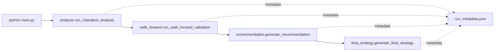

# Operations Runbook

**Audience:** Platform operators, DevOps, and anyone running batch experiments
or curating artifacts for review.

This runbook summarises the end-to-end workflow, environment toggles, and
artifact expectations for production-quality runs.

## Pre-run checklist

1. **Python** – Use Python 3.12 or 3.13. Activate a virtual environment if
   possible.
2. **Dependencies** – Install requirements and dev tooling:

   ```bash
   python -m pip install -r requirements.txt -r requirements-dev.txt
   ```

3. **Real vectorbt** – Ensure the stub is not on the import path:

   ```bash
   python -c "from deps import ensure_real_vectorbt; ensure_real_vectorbt()"
   ```

4. **Environment file** – Copy `.env.example` to `.env`, then fill in Binance
   credentials and run-specific overrides.
5. **Data cache hygiene** – `data_cache/` stores Parquet snapshots. Remove stale
   files if storage pressure arises, but keep caches intact during a run so
   hashes recorded in `run_metadata.json` remain valid.

### Useful environment toggles

| Variable | Purpose |
| --- | --- |
| `GA_SEED` | Overrides `config.SEED` for deterministic replays. |
| `GA_QUICK_TEST=1` | Shrinks GA population/generation counts for smoke tests. |
| `USE_VBT_STUB=1` | Forces the lightweight vectorbt stub in tests (never set for production runs). |
| `ENV=prod` | Enables production defaults in `config.py` (for example stricter warnings). |
| `FSS_STRICT=1` | Converts missing asset weights during final-strategy synthesis into hard failures. |

## Workflow overview



- `python main.py` orchestrates the GA, champion analysis, and optionally the
  downstream stages.
- Walk-forward validation writes `walk_forward_summary.json` and
  `walk_forward_per_asset.csv` (schema v1.0) under `run_dir / "walk_forward"`.
- The recommendation stage emits `strategy_recommendation.md` and a structured
  payload under `run_metadata.json["recommendation"]`.
- Final-strategy synthesis produces `final_strategy.md` plus a payload in
  `run_metadata.json["final_strategy"]`.

## Standard batch run

1. Set a dedicated run directory and optional metadata prefix:

   ```python
   from pathlib import Path

   import analysis

   run_dir = Path("./runs/2024-01-15")
   run_dir.mkdir(parents=True, exist_ok=True)
   analysis.set_run_dir(run_dir)
   ```

2. Launch the GA optimisation:

   ```bash
   python main.py
   ```

3. Inspect artifacts:
   - `ga_fitness_evolution.png` – GA convergence plot.
   - `analysis/` – champion backtest plots, CSVs, and metadata.
   - `run_metadata.json` – merged metadata from every stage.

4. Re-run downstream stages in isolation if required:

   ```python
   from recommendation import generate_recommendation
   from final_strategy import generate_final_strategy

   context = {"run_dir": run_dir}
   generate_recommendation(context)
   generate_final_strategy(context)
   ```

## Artifact expectations

- **Strategy recommendation** (`strategy_recommendation.md`) – narrates champion
  quality, asset classes, and parameter stability. The payload stored in
  `run_metadata.json` mirrors the markdown and is suitable for automation.
- **Final strategy** (`final_strategy.md`) – reports synthesised GA parameters,
  jackknife sensitivity notes, and final asset weights. When
  `FSS_STRICT=1`, missing weights abort the run instead of defaulting to `0.0`.
- **Run metadata** (`run_metadata.json`) – deduplicated list of artifacts,
  runtime information, cache hashes, library versions, and the recommendation
  / final-strategy payloads.

## Troubleshooting

- **Indicator errors** – Run `python preflight.py` or call
  `preflight.check_indicator_contracts` with a sample OHLC frame to surface
  missing columns/bands before running the GA.
- **Vectorbt import issues** – Ensure the stub (`vbt_stub.py`) is not imported in
  production workflows; `deps.ensure_real_vectorbt` raises when the real package
  is absent.
- **Walk-forward artifacts missing** – Re-run `python walk_forward.py` with the
  same `run_dir` to regenerate summary/per-asset files before calling the
  recommendation or final-strategy stages.
- **Metadata conflicts** – `run_metadata.merge_run_metadata` uses a file lock and
  preserves prior entries. If corruption occurs the function renames the file to
  `*.corrupt-<timestamp>.json` and starts fresh.

## Executor heuristics & data registry

- `config.GLOBAL_EXECUTOR` controls a single process pool that services every
  multi-asset evaluation. The executor starts with `batch_size` candidates per
  submission and adjusts in ±25% steps (bounded by
  `min_batch_size`/`max_batch_size`). Adjustments only occur after
  `batch_cooldown_submissions` batches to avoid oscillation. When the observed
  latency (`latency_target_ms`) stays below target and the queue sits under
  `queue_low_watermark`, the batch size increases; when the queue reaches
  `queue_high_watermark` or latency blows past the target, it shrinks. Example:
  with `batch_size=8` and the queue mostly empty, the next adjustment raises the
  batch to `10` after at least six submissions; if latency spikes the following
  cycle, the batch contracts back to `8`.
- `memory_target_gib` caps the effective number of in-flight batches. The
  executor maintains a moving average of batch sizes (`bytes_avg`) and reduces
  the cap whenever `bytes_avg × in_flight_cap` would exceed the configured
  memory budget. For instance, with `memory_target_gib=0.5` and 128 MiB batches,
  the cap drops from `8` to `4` to keep working memory near the 512 MiB target.
- `DATA_REGISTRY` governs how OHLCV frames are shared with workers. `backend=
  "auto"` picks columnar memmaps when a window has many numeric columns while
  falling back to structured records for mixed/object dtypes. The registry
  exposes descriptors tagged with `schema_version` so future upgrades can detect
  incompatible layouts without breaking existing workers.
