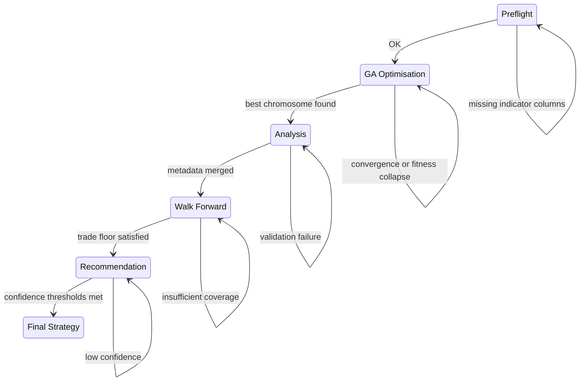

# Operations Runbook

**Audience:** research leads and operations engineers responsible for running, monitoring, and troubleshooting scheduled optimisations.

This runbook captures pre-flight checks, routine operations, and recovery flows for the GA trading framework. It assumes you have read the [Getting Started](getting_started.md) guide and focuses on keeping recurring jobs healthy.

## 1. Pre-run checklist

1. **Activate the environment and install dependencies.**
   ```bash
   source .venv/bin/activate
   python -m pip install -r requirements.txt
   python -m pip install -r requirements-dev.txt  # ensures lint/test tooling exists
   ```
2. **Confirm the real `vectorbt` package is installed.** The orchestrator aborts early if a stub is found.
   ```bash
   python - <<'PY'
   from deps import ensure_real_vectorbt

   ensure_real_vectorbt()
   print("vectorbt check passed")
   PY
   ```
3. **Validate configuration overrides.** Non-default schedules often use environment variables. Dump the resolved configuration once to ensure the derived windows and toggles match expectations.
   ```python
   import config

   config.initialize_config(force=True)
   print({
       "timeframe": config.TIMEFRAME,
       "training_period": config.TRAINING_PERIOD,
       "validation_period": config.VALIDATION_PERIOD,
       "walk_forward": config.ENABLE_WALK_FORWARD_VALIDATION,
       "multi_asset": config.MULTI_ASSET["enabled"],
   })
   ```
4. **Warm the indicator cache (optional).** Run the preflight helper when onboarding new rules to surface missing indicator columns before the overnight job.
   ```python
   import pandas as pd

   import config
   import data_loader
   from main import indicator_preflight
   from strategy_rules import STRATEGY_RULES

   config.initialize_config(force=True)
   sample, _ = data_loader.get_data(
       ticker=config.PRIMARY_TICKER,
       start=config.TRAINING_PERIOD[0],
       end=config.TRAINING_PERIOD[1],
       interval=config.TIMEFRAME,
   )
   indicator_preflight(sample.tail(500), STRATEGY_RULES)
   ```

## 2. Routine operation

### 2.1 Scheduled optimisation

```bash
python main.py --no-fss  # skip final strategy synthesis if operations handles it separately
```

- Progress updates print as `Generation <n>/<total>` with an estimated time remaining.
- Artifacts land in `Reporting/<timestamp>_<timeframe>/`. The `Reporting/latest` symlink tracks the most recent successful run.
- Metadata from every stage is appended to `run_metadata.json` via `run_metadata.merge_run_metadata`, enabling downstream automation to diff runs safely.

### 2.2 Post-run verification

```python
from pathlib import Path
import json

run_dir = Path("Reporting/latest")
meta_path = run_dir / "run_metadata.json"

with meta_path.open() as fh:
    metadata = json.load(fh)

print(metadata["fitness"]["champion_score"])
print(metadata["analysis"]["validation_return"])
```

- Confirm the champion score and validation return fall within expected historical bands.
- Review `walk_forward/` CSVs to ensure minimum trade counts meet `config.MULTI_ASSET["trade_floor"]` expectations.
- When a qualitative review completes, append an audit trail to the metadata without disturbing existing keys.
  ```python
  from run_metadata import merge_run_metadata

  merge_run_metadata(meta_path, {"operations": {"reviewed_by": "alice", "reviewed_at": "2025-01-02"}})
  ```
- If downstream weighting is deferred, feed the run directory to `final_strategy.generate_final_strategy({"run_dir": run_dir})` once approvals are in place.

## 3. Failure handling



| Symptom | Likely cause | Recovery steps |
| --- | --- | --- |
| `ensure_real_vectorbt` raises `RuntimeError` | The stub in `vbt_stub.py` is still on `PYTHONPATH`. | Install `vectorbt` in the active environment and ensure `USE_VBT_STUB=0`. |
| GA stalls with `nan` fitness | A rule emitted non-finite signals or a division by zero occurred. | Re-run with `GA_QUICK_TEST=1` and inspect `strategy_engine` logs; ensure indicator params do not evaluate to zero-length windows. |
| Walk-forward stage drops most assets | Historical coverage fell below `config.COVERAGE_THRESHOLD`. | Backfill data (rerun `data_loader` with a wider start date) or lower the threshold for smoke runs only. |
| `final_strategy` aborts with `ConfigurationError` | Overrides in `FINAL_STRATEGY` conflict (`PARAM_RCV_WATCHLIST >= PARAM_RCV_UNSTABLE`, weights not summing to 1). | Adjust the configuration and rerun only the final synthesis step against the preserved run directory. |

## 4. Maintenance tasks

- **Prune stale caches.** Delete `data_cache/*.parquet` entries older than the oldest training window to force a refresh with updated provider data.
  ```bash
  find data_cache -name '*.parquet' -mtime +120 -delete
  ```
- **Rebaseline tests.**
  ```bash
  make test
  ```
  CI runs `pre-commit` and `pytest -q -n auto` with coverage thresholds, mirroring the local workflow.
- **Document strategy changes.** When enabling new indicators or altering exit logic, update `docs/strategy_authoring.md` and include a brief summary in `run_metadata.json` by merging an `{"changelog": "..."}` payload using `merge_run_metadata`.

Keeping these routines codified ensures production runs remain reproducible and actionable.
