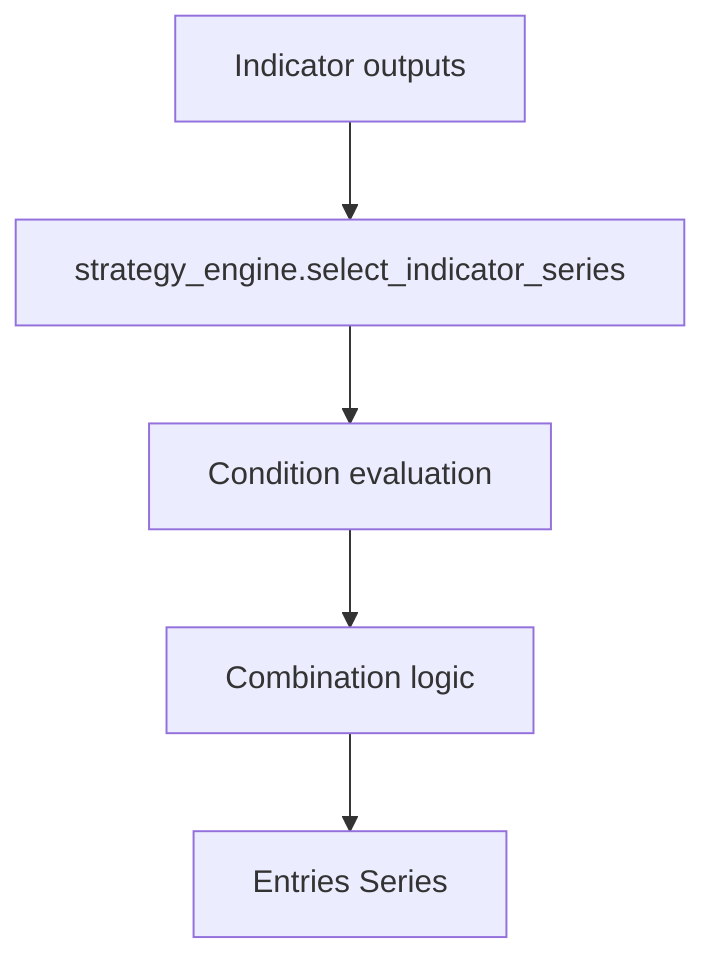

# Strategy Authoring Guide

**Audience:** Quant researchers and developers designing new entry rules,
indicators, or GA genes.

This guide explains how to extend `STRATEGY_RULES`, add indicators, and maintain
deterministic behaviour across the optimisation pipeline.

## Anatomy of a rule

`strategy_rules.py` stores an `entry_rules` block containing ordered conditions.
Each condition can be toggled via `is_active` and may expose parameters as GA
genes. Below is a representative rule:

```python
{
    "is_active": True,
    "rule_name": "RSI_Momentum_Filter",
    "indicator": "rsi",
    "params": {
        "period": {"gene": "rsi_period", "low": 7, "high": 21, "step": 1},
    },
    "condition": {
        "type": "indicator_is_above_value",
        "value": {
            "gene": "rsi_threshold",
            "low": 45,
            "high": 70,
            "step": 1,
        },
    },
}
```

`gene_parser.parse_genes_from_config` discovers active gene definitions and
returns `(gene_space, gene_map, gene_types)` for PyGAD. Ensure integer steps are
compatible with the indicator logic—vectorbt expects matching dtypes when
signals are injected back into the rule tree.

## Combination logic and NaN policies

- `combination_logic` accepts `AND`, `OR`, or `VOTE` (case-insensitive). Vote
  mode uses `vote_threshold` when supplied or defaults to majority wins.
- `nan_policy` defaults to `FALSE` (NaNs become `False`). Use `PROPAGATE` to
  keep NaNs or `FORWARD_FILL` to carry forward the last valid signal. Forward
  fill honours `config.NAN_FFILL_LOOKBACK`.



## Indicator contracts

- Add new indicator functions to `indicator_library.py` with signatures like
  `def ema(ohlc: pd.DataFrame, period: int) -> pd.Series`.
- Declare column/band expectations in `indicator_contracts.py`. Contracts feed
  `preflight.check_indicator_contracts`, which normalises outputs via
  `indicator_contracts.normalize_output` before verifying that the requested
  column exists.
- Use `condition["column"]` or `condition["band"]` to select specific outputs.
  When both are present `column` wins. Missing columns raise unless
  `strict_column=False` is set either globally or per rule.

Example indicator addition:

```python
# indicator_library.py
def kama(df: pd.DataFrame, period: int, fast: int = 2, slow: int = 30) -> pd.Series:
    return ta.kama(df["Close"], length=period, fast=fast, slow=slow)

# indicator_contracts.py
CONTRACTS["kama"] = contracts.SingleOutput(column_name="KAMA_{period}_{fast}_{slow}")
```

Run `python preflight.py` or call `preflight.check_indicator_contracts(sample, rules)`
before long GA sessions to surface missing columns early.

## Multi-asset considerations

When `config.MULTI_ASSET["enabled"]` is `True`, the fitness evaluator aggregates
per-asset composite scores. Keep the following in mind:

- Set `condition["per_asset"] = True` when rules require asset-specific state.
- Ensure exit parameters returned by `portfolio_utils.extract_exit_params` are
  compatible with each asset.
- Trade-floor penalties from `trade_floor.scale_floor` depend on
  `config.MULTI_ASSET` settings (`min_total_trades`, `zero_trade_policy`, etc.).

## Reproducibility tips

- Respect `config.SEED` / `GA_SEED` overrides; avoid introducing additional
  randomness without threading the seed.
- Use `run_metadata.merge_run_metadata` when writing new artifacts so metadata
  remains atomic and deduplicated.
- Extend `tests/` with deterministic fixtures (for example setting
  `USE_VBT_STUB=1` in `tests/conftest.py`) whenever behaviour changes.
