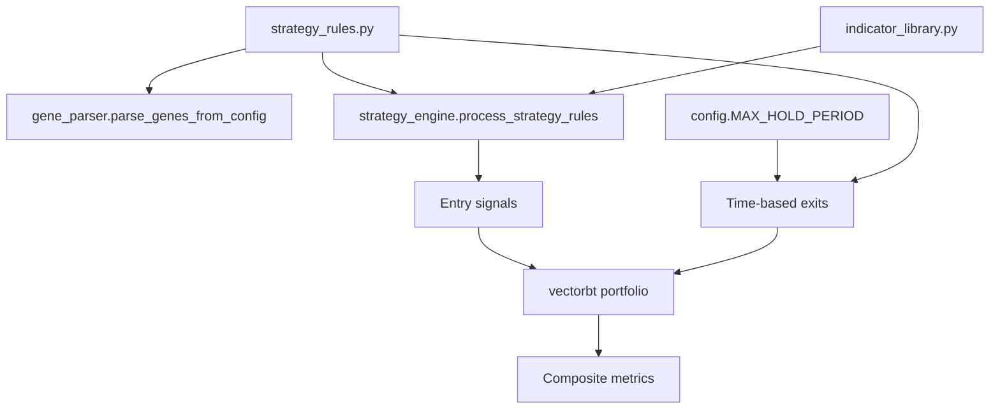

# Strategy Authoring Guide

**Audience:** quantitative strategists creating or modifying rules in `strategy_rules.py`.

Strategies are declared as data structures rather than imperative code. The GA reads those structures, injects gene values, and the strategy engine interprets them into entry and exit signals. This document summarises the schema and provides practical tips for extending it safely.

## Entry rule anatomy

Each rule is a dictionary with optional GA genes:

```python
{
    "is_active": True,
    "rule_name": "RSI_Momentum_Filter",
    "indicator": "rsi",
    "params": {
        "period": {"gene": "rsi_period", "low": 7, "high": 21, "step": 1}
    },
    "condition": {
        "type": "indicator_is_above_value",
        "value": {"gene": "rsi_threshold", "low": 45, "high": 70, "step": 1},
    },
}
```

- `indicator` maps to a function in `indicator_library.INDICATOR_REGISTRY`. Aliases such as `"bb"`, `"kc"`, `"dmi"`, and `"uo"` are normalised automatically.
- `params` may contain literal values or GA genes. Genes support integer/float ranges (`low`, `high`, `step`), explicit option lists (`options`), or boolean toggles.
- `condition` defines how price interacts with the indicator output. Built-in types include `price_is_above_indicator`, `indicator_is_above_value`, and Bollinger/Keltner/Donchian shortcuts such as `price_crosses_above_upper_band`.

## Combination logic & NaN handling

The `entry_rules` block controls how individual conditions are combined:

```python
"entry_rules": {
    "combination_logic": "VOTE",  # AND | OR | VOTE
    "vote_threshold": {"gene": "vote_threshold", "low": 2, "high": 5, "step": 1},
    "nan_policy": "FALSE",         # FALSE | PROPAGATE | FORWARD_FILL
    "ffill_lookback": 0,
    "conditions": [...],
}
```

- `combination_logic` may itself be a gene (`{"gene": "combo", "options": ["AND", "VOTE"]}`).
- `vote_threshold` is clamped to the number of active conditions during `config.initialize_config()`.
- `nan_policy` determines how incomplete indicator windows behave before combination. `FORWARD_FILL` honours `ffill_lookback` (0 = unlimited).

## Selecting indicator outputs

Multi-output indicators supply multiple columns. The engine applies sensible defaults but you can override them:

| Indicator | Default selection | Override hints |
| --- | --- | --- |
| `macd` | Histogram (`MACDh_*`) | `condition["column"] = "MACDs"` for the signal line |
| `bbands`, `keltner`, `donchian`, `ma_envelope` | Middle band | `condition["band"] = "upper" / "lower"` or use `*_upper_band` condition types |
| `stoch` | %K (`STOCHk_*`) | Set `condition["column"] = "STOCHd_*"` for %D |
| `adx`/`dmi` | ADX line | `condition["column"] = "DM+"` / `"DM-"` |
| `ichimoku` | Baseline (`IKS_*`) | `condition["column"] = "IKH_*"` for span values |
| `pivot_points` | `P` | `condition["column"] = "R1"`, etc. |

Additional controls:

- `condition["column"]` overrides `condition["band"]` when both are provided.
- Set `strict_column=False` globally or per-condition to fall back to the first available column instead of raising a `KeyError`. Fallbacks emit warnings so misconfigurations are visible in logs.

## Trade-management exits

`exit_rules` now describe a multi-gene trade-management block that feeds the
Numba-accelerated simulator in `exits_nb.generate_dynamic_exit_signals_nb` when
`config.USE_DYNAMIC_EXIT_SIMULATOR` is `True`:

```python
"exit_rules": {
    "stop_loss": {"type": "percentage", "params": {"value": {"gene": "stop_loss_pct"}}},
    "trade_management": {
        "num_tp_levels": {"gene": "num_tp_levels", "low": 1, "high": 4, "step": 1},
        "tp_pct_1": {"gene": "tp_pct_1", "low": 0.005, "high": 0.50, "step": 0.005},
        "tp_pct_2": {"gene": "tp_pct_2", "low": 0.010, "high": 0.50, "step": 0.005},
        "tp_pct_3": {"gene": "tp_pct_3", "low": 0.015, "high": 0.50, "step": 0.005},
        "tp_pct_4": {"gene": "tp_pct_4", "low": 0.020, "high": 0.50, "step": 0.005},
        "tp_trailing_enabled": True,
        "tp_trailing_pct": {
            "gene": "tp_trailing_pct",
            "low": 0.0,
            "high": 0.10,
            "step": 0.001,
            "is_active": True,
        },
        "sl_break_even_mode": {"gene": "sl_break_even_mode", "options": ["none", "breakeven", "follow_tp"]},
        "sl_timeout_enabled": True,
        "sl_timeout_bars": {
            "gene": "sl_timeout_bars",
            "low": 0,
            "high": 12,
            "step": 1,
            "is_active": True,
        },
        "sl_trailing_enabled": True,
        "sl_trailing_pct": {
            "gene": "sl_trailing_pct",
            "low": 0.0,
            "high": 0.20,
            "step": 0.001,
            "is_active": True,
        },
    },
}
```

Key behaviours:

- Positions are split equally across `num_tp_levels` (1–4). Each level uses
  `tp_pct_*` measured from the entry price and is repaired to be strictly
  increasing on decode. Multiple TPs can fill on the same bar; the simulator
  records fractional exits per reason so metadata captures the full breakdown.
- Fractional exits are forwarded to
  `Portfolio.from_signals(..., size=exit_size, accumulate=True,
  size_type="amount")`. Order sizes are literal units: the first entry submits
  `BASE_ENTRY_SIZE` units, partial exits reduce that amount, and the final
  forced close liquidates the remaining quantity. Because vectorbt's replace
  mode cannot express staged reductions, `config.DYNAMIC_EXIT_ACCUMULATE`
  **must** remain `True` whenever the dynamic simulator is enabled.
- `config.DYNAMIC_EXIT_SIZE_MODE` controls how simulator fractions are
  interpreted when building orders. The default, "fraction_base", scales
  fractional outputs by `BASE_ENTRY_SIZE`; "fraction_current" uses the live
  open quantity, and "absolute" treats simulator outputs as raw unit sizes.
- Take-profit ladders are repaired to enforce a minimum separation of 0.5%
  between successive levels and are capped at 50% across all supported
  timeframes. The GA gene bounds are clamped to these caps during
  `config.initialize_config()` so the
  search space matches the repair policy. If a cap cannot accommodate the
  maximum configured TP level count, `initialize_config` emits a warning and
  reduces the `num_tp_levels` search space for the active timeframe.
  Individual strategies can tighten the ceiling further by setting
  `trade_management.tp_pct_cap`; the simulator honours the smaller of this
  override and the timeframe-wide cap when repairing ladders.
- After a TP fills, break-even adjustments apply immediately:
  - `breakeven` moves the stop to entry once TP1 executes.
  - `follow_tp` ratchets the stop to the most recent TP price.
- Trailing stops (`sl_trailing_*`) only move in the favourable direction and are
  distinguished from static stops via the `ExitReason.TSL` code.
- When `tp_trailing_pct` resolves to a positive value **and more than one TP
  level is active**
  the final TP switches into trailing mode: once price reaches the static
  target the remaining size is protected by a trailing take-profit
  (`ExitReason.TTP`).
- Stop-loss timeouts (`sl_timeout_*`) postpone exits for `N` bars after the
  first stop breach; recovery above the stop cancels the timer. The global
  hold timeout enforced by `config.MAX_HOLD_PERIOD` exits using
  `ExitReason.SL` on the configured bar so no additional enum is required.

Hierarchy rules applied during decode:

- `tp_trailing_pct` is treated as disabled whenever it resolves to `0.0`, when
  `num_tp_levels == 1`, or when `tp_trailing_enabled` is set to `False`
  (removing the gene from the GA search space).
- `sl_timeout_bars` uses `0` to disable the timeout feature; setting
  `sl_timeout_enabled` to `False` removes the gene entirely.
- `sl_trailing_pct` disables trailing stops when it resolves to `0.0`; toggling
  `sl_trailing_enabled` to `False` drops the gene from the search space.

Per-bar precedence is deterministic:

1. Evaluate TP levels (lowest → highest) using bar highs.
2. Apply break-even / follow-TP adjustments.
3. Update trailing stop and trailing TP ratchets.
4. Check the hard stop using bar lows (respecting timeouts).
5. Check the trailing take-profit trigger.

Example: with `num_tp_levels=3`, the first TP fills one third of the
position and activates break-even logic, the second TP can fill on the same bar
leaving one third running, and the final slice either hits the static TP3 or
switches into trailing mode when `tp_trailing_pct` is positive.

Exit reasons are encoded as integers for telemetry. The primary values are:

| Code | Meaning |
| --- | --- |
| 1–4 | `TP1`–`TP4` partial exits |
| 5 | `SL` (static/break-even stop) |
| 6 | `SL_TIMEOUT` |
| 7 | `TSL` (trailing stop) |
| 8 | `TTP` (trailing take-profit) |

JSON summaries use the enum names (for example `"TP1"`, `"SL"`) and include the
numeric `code` for compatibility with earlier analytics scripts.

The simulator emits per-reason fraction arrays so downstream reporting can
aggregate exact position sizing. `analysis` writes the aggregated breakdown to
`exit_reason_breakdown.csv` when
`config.EXIT_TELEMETRY["write_reason_breakdown_csv"]` is true (enabled by
 default). Regardless of the toggle, both `analysis` and `fitness` capture the
 exit parameter snapshot, the per-reason fractions, and telemetry metrics
 such as the average TP level reached, breakeven-touch rate, timeout usage, and
 trailing-TP hit rate in `run_metadata.json`. Set
 `config.EXIT_TELEMETRY["collect_traces"] = False` (or the legacy
 `"enabled" = False` alias) to skip per-bar traces while keeping these
 aggregated summaries. The champion analysis step also writes `exit_kpi_strip.csv`
 with the headline metrics alongside the equity chart for quick inspection.

Set `config.USE_DYNAMIC_EXIT_SIMULATOR = False` to fall back to the legacy
percentage stops (`extract_exit_params`) when debugging.

## Genes and parsing

`gene_parser.parse_genes_from_config(STRATEGY_RULES)` discovers every active gene and returns `(gene_space, gene_map, gene_types)` for the GA. Keep these guidelines in mind:

- Use descriptive `gene` names; they appear in console summaries and metadata.
- Provide `step` values for discrete ranges to avoid floating-point drift. For floats, `step` can be omitted when any value in `[low, high]` is valid.
- Option genes (`{"options": [...]}`) accept strings, numbers, or booleans; the parser returns the option list in `gene_space` and infers the correct `gene_type`.

## Preflight and debugging

Before optimisation starts, `main.indicator_preflight` computes each active indicator on a sample of training data and validates column names via `preflight.check_indicator_contracts()`. To harden the workflow:

- Set `config.PREFLIGHT_ALL_INDICATORS = True` to evaluate *every* registered indicator once, not just active rules.
- Review the metadata written to `run_metadata.json` for `indicator_columns` and `preflight_sufficiency_hint` if you encounter errors.
- Use `strategy_engine.canonical_rule_label(rule)` when aggregating diagnostics; it generates stable identifiers for each condition.

## Visual reference



Design rules declaratively, rely on preflight checks, and keep genes well-named—the GA and downstream recommendation reports surface those names when explaining champion behaviour.
