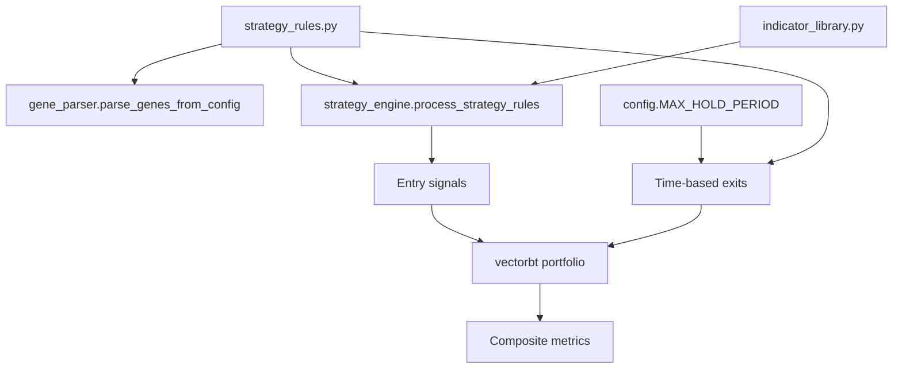

# Strategy Authoring Guide

**Audience:** quantitative strategists creating or modifying rules in `strategy_rules.py`.

Strategies are declared as data structures rather than imperative code. The GA reads those structures, injects gene values, and the strategy engine interprets them into entry and exit signals. This document summarises the schema and provides practical tips for extending it safely.

## Entry rule anatomy

Each rule is a dictionary with optional GA genes:

```python
{
    "is_active": True,
    "rule_name": "RSI_Momentum_Filter",
    "indicator": "rsi",
    "params": {
        "period": {"gene": "rsi_period", "low": 7, "high": 21, "step": 1}
    },
    "condition": {
        "type": "indicator_is_above_value",
        "value": {"gene": "rsi_threshold", "low": 45, "high": 70, "step": 1},
    },
}
```

- `indicator` maps to a function in `indicator_library.INDICATOR_REGISTRY`. Aliases such as `"bb"`, `"kc"`, `"dmi"`, and `"uo"` are normalised automatically.
- `params` may contain literal values or GA genes. Genes support integer/float ranges (`low`, `high`, `step`), explicit option lists (`options`), or boolean toggles.
- `condition` defines how price interacts with the indicator output. Built-in types include `price_is_above_indicator`, `indicator_is_above_value`, and Bollinger/Keltner/Donchian shortcuts such as `price_crosses_above_upper_band`.

## Combination logic & NaN handling

The `entry_rules` block controls how individual conditions are combined:

```python
"entry_rules": {
    "combination_logic": "VOTE",  # AND | OR | VOTE
    "vote_threshold": {"gene": "vote_threshold", "low": 2, "high": 5, "step": 1},
    "nan_policy": "FALSE",         # FALSE | PROPAGATE | FORWARD_FILL
    "ffill_lookback": 0,
    "conditions": [...],
}
```

- `combination_logic` may itself be a gene (`{"gene": "combo", "options": ["AND", "VOTE"]}`).
- `vote_threshold` is clamped to the number of active conditions during `config.initialize_config()`.
- `nan_policy` determines how incomplete indicator windows behave before combination. `FORWARD_FILL` honours `ffill_lookback` (0 = unlimited).

## Selecting indicator outputs

Multi-output indicators supply multiple columns. The engine applies sensible defaults but you can override them:

| Indicator | Default selection | Override hints |
| --- | --- | --- |
| `macd` | Histogram (`MACDh_*`) | `condition["column"] = "MACDs"` for the signal line |
| `bbands`, `keltner`, `donchian`, `ma_envelope` | Middle band | `condition["band"] = "upper" / "lower"` or use `*_upper_band` condition types |
| `stoch` | %K (`STOCHk_*`) | Set `condition["column"] = "STOCHd_*"` for %D |
| `adx`/`dmi` | ADX line | `condition["column"] = "DM+"` / `"DM-"` |
| `ichimoku` | Baseline (`IKS_*`) | `condition["column"] = "IKH_*"` for span values |
| `pivot_points` | `P` | `condition["column"] = "R1"`, etc. |

Additional controls:

- `condition["column"]` overrides `condition["band"]` when both are provided.
- Set `strict_column=False` globally or per-condition to fall back to the first available column instead of raising a `KeyError`. Fallbacks emit warnings so misconfigurations are visible in logs.

## Exit rules

Exit logic mirrors entry rules but focuses on percentage-based stops:

```python
"exit_rules": {
    "stop_loss": {
        "is_active": True,
        "type": "percentage",
        "params": {"value": {"gene": "stop_loss_pct", "low": 0.02, "high": 0.12, "step": 0.005}},
    },
    "trailing_stop": {...},
    "take_profit": {...},
}
```

Exit settings feed directly into `vectorbt.Portfolio.from_signals` via `fitness.FitnessEvaluator`. Time-based exits use `config.MAX_HOLD_PERIOD`, so ensure configuration is initialised before processing rules.

## Genes and parsing

`gene_parser.parse_genes_from_config(STRATEGY_RULES)` discovers every active gene and returns `(gene_space, gene_map, gene_types)` for the GA. Keep these guidelines in mind:

- Use descriptive `gene` names; they appear in console summaries and metadata.
- Provide `step` values for discrete ranges to avoid floating-point drift. For floats, `step` can be omitted when any value in `[low, high]` is valid.
- Option genes (`{"options": [...]}`) accept strings, numbers, or booleans; the parser infers the correct `gene_type`.

## Preflight and debugging

Before optimisation starts, `main.indicator_preflight` computes each active indicator on a sample of training data and validates column names via `preflight.check_indicator_contracts()`. To harden the workflow:

- Set `config.PREFLIGHT_ALL_INDICATORS = True` to evaluate *every* registered indicator once, not just active rules.
- Review the metadata written to `run_metadata.json` for `indicator_columns` and `preflight_sufficiency_hint` if you encounter errors.
- Use `strategy_engine.canonical_rule_label(rule)` when aggregating diagnostics; it generates stable identifiers for each condition.

## Visual reference



Design rules declaratively, rely on preflight checks, and keep genes well-named—the GA and downstream recommendation reports surface those names when explaining champion behaviour.
